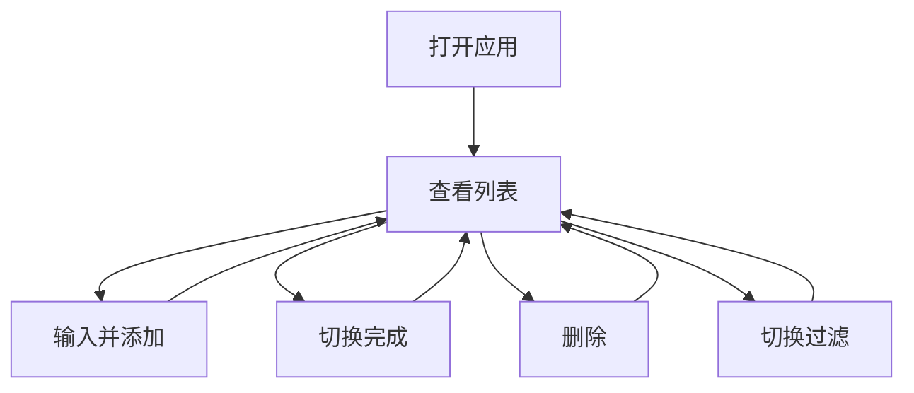

# 设计规范 — 极简个人待办（示例）

**状态**：已确认（示例）  
**布局**：单栏居中内容卡  
**配色**：套装「纸白 + 墨蓝」

## 1. 设计原则

- 一屏内完成主路径
- 主操作不超过 2 次点击
- 空状态友好、有引导

## 2. 布局

- 顶区：标题 + 简短说明  
- 中区：输入框固定上方，列表可滚动  
- 底区：过滤与「清除已完成」

## 3. 交互流程

## 4. 配色

| 角色 | 色值 |
| ---- | ---- |
| 主色 | #2563EB |
| 背景 | #F8FAFC |
| 卡片 | #FFFFFF |
| 文字 | #0F172A |
| 次级文字 | #64748B |
| 成功/完成 | #16A34A |
| 危险 | #DC2626 |

## 5. 页面要点

- **主页**：输入 placeholder「添加待办…」；列表项含复选框、标题、删除  
- **状态**：加载（首屏读 localStorage 极短，可用无闪烁）；空（插画文案 + 聚焦输入）；错误（存储失败提示）

## 6. 原型

示例包未附 HTML；Full Flow 下应有 `docs/ui-prototypes/index.html`。
