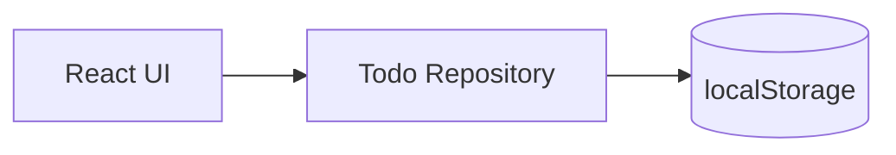
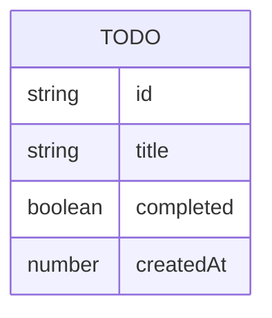

# 技术方案 — 极简个人待办（示例）

**状态**：已确认（示例）

## 1. 架构

纯前端静态应用：浏览器 → UI → localStorage。无后端。

## 2. 选型

| 层级 | 选型 | 理由 |
| ---- | ---- | ---- |
| UI | React + Vite | 生态熟、构建快 |
| 语言 | TypeScript | 待办模型清晰 |
| 样式 | CSS Modules 或轻量 utility | 避免过重 UI 库 |
| 测试 | Vitest + Testing Library | 与 Vite 一体 |
| 部署 | 任意静态托管（如 GitHub Pages / Cloudflare Pages） | 无服务器 |

## 3. 数据模型

## 4. 安全与隐私

- 无网络写入业务数据
- 后续若加同步，须另开阶段 3 修订

## 5. 性能预算

- 首屏 JS < 200KB gzip（目标）
- 交互反馈 < 100ms

## 6. 外部资源

- 无必须 API Key
