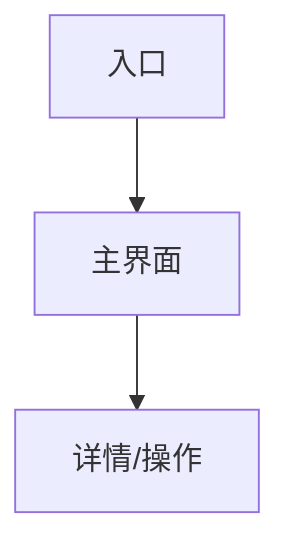

# 设计规范（Design Spec）

> 阶段 2 产出 · 与 `docs/ui-prototypes/` 配套  
> English: Design Specification

**状态**：草稿 / 已确认  
**确认日期**：YYYY-MM-DD  
**布局方案**：方案 A / B / C  
**配色方案**：套装 1 / 2 / 3

---

## 1. 整体设计原则

-
-
-

## 2. 信息架构与布局

- **选定布局简述**：
- **导航结构**：
- **关键页面列表**：

## 3. 交互流程

（按产品替换为完整 Workflow。）

## 4. 配色方案

| 角色 | 色值 | 用途 |
| ---- | ---- | ---- |
| 主色 | #      |      |
| 辅色 | #      |      |
| 文字主色 | #  |      |
| 文字次色 | #  |      |
| 成功 / 警告 / 错误 / 信息 | # / # / # / # | 功能色 |

## 5. 字体与排版层级

| 层级 | 字号 / 字重 | 用途 |
| ---- | ----------- | ---- |
| H1   |             |      |
| H2   |             |      |
| Body |             |      |
| Caption |          |      |

## 6. 各页面 UI 设计要点

### 页面：

- 目标：
- 主要模块：
- 关键交互：
- 状态：正常 / 加载 / 空 / 错误

## 7. 通用交互规范

- **按钮**：主/次/危险、禁用态
- **表单**：校验时机、错误文案位置
- **加载**：骨架屏 / spinner 约定
- **空状态**：文案 + 引导动作
- **错误**：可重试 / 联系支持
- **弹窗 / 抽屉**：何时使用、关闭方式

## 8. 响应式与适配

- **断点**：
- **移动端差异**：
- **不适用说明**（纯桌面/CLI）：

## 9. 可访问性要点

- 对比度目标（如 WCAG AA）
- 焦点与键盘路径
- 语义化与 `alt`
- 其它：

## 10. 原型索引

| 页面 | 文件路径 | 备注 |
| ---- | -------- | ---- |
|      | docs/ui-prototypes/xxx.html |      |

Fast Track 可改为线框描述，无 HTML 时在此说明。

## 11. 设计决策记录

| 决策 | 理由 |
| ---- | ---- |
|      |      |

---

## 确认清单

- [ ] 布局已选定
- [ ] 流程图已确认
- [ ] 配色已确认
- [ ] 原型或替代物已审查
- [ ] 用户已确认本文档
