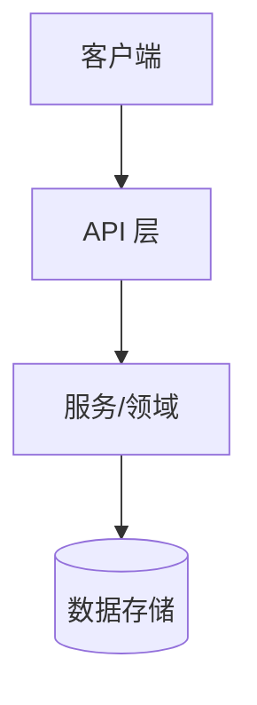
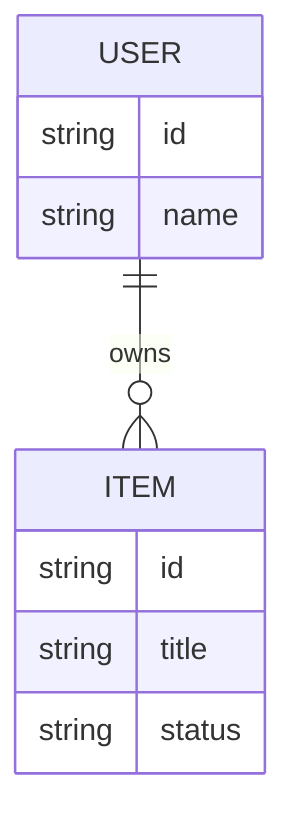
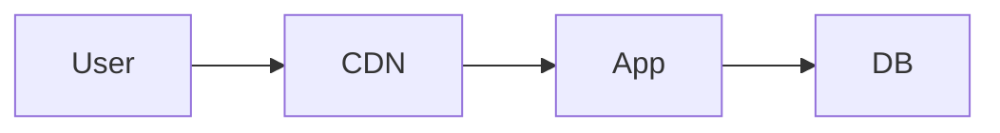

# 技术实现方案（Tech Solution）

> 阶段 3 产出 · 确认后冻结选型  
> English: Technical Solution

**状态**：草稿 / 已确认  
**确认日期**：YYYY-MM-DD  
**模式**：Full Flow / Fast Track

---

## 1. 系统整体技术架构

**文字说明**：

## 2. 各层技术选型及理由

| 层级 | 选型 | 版本范围 | 理由 | 候选对比 |
| ---- | ---- | -------- | ---- | -------- |
| 前端 |      |          |      |          |
| 后端 |      |          |      |          |
| 数据库 |    |          |      |          |
| 缓存/队列 |  |          |      |          |
| 部署平台 |  |          |      |          |

## 3. 数据模型设计

**实体说明**：

| 实体 | 说明 | 关键字段 |
| ---- | ---- | -------- |
|      |      |          |

## 4. 部署架构

- **环境**：dev / staging / prod
- **CI/CD 思路**：
- **扩缩容假设**：

## 5. 集成方案

| 服务 | 用途 | 必需 | 备注 |
| ---- | ---- | ---- | ---- |
|      |      | 是/否 |      |

## 6. 安全考虑

- 认证与授权：
- 传输与存储：
- 注入 / XSS / CSRF 等（按形态）：
- 密钥管理：环境变量 + `.env.example`；禁止硬编码

## 7. 性能预算

| 指标 | 目标 | 备注 |
| ---- | ---- | ---- |
| 首屏 / 启动 |  |  |
| API p95 |  |  |
| 包体 / 资源 |  |  |

## 8. 可观测性

- 日志：
- 监控与告警：
- 错误追踪：

## 9. 外部资源需求清单

| 资源 | 用途 | 提供方 | 状态 |
| ---- | ---- | ------ | ---- |
| API Key / 账号 |  | 用户 / 第三方 | 待提供 |

## 10. 风险与折中

| 风险 | 影响 | 缓解 |
| ---- | ---- | ---- |
|      |      |      |

---

## 确认清单

- [ ] 技术偏好或推荐已确认
- [ ] 架构与数据模型已确认
- [ ] 安全、性能、外部资源已过目
- [ ] 选型冻结（变更须回溯改文档）
- [ ] 用户已确认本文档
